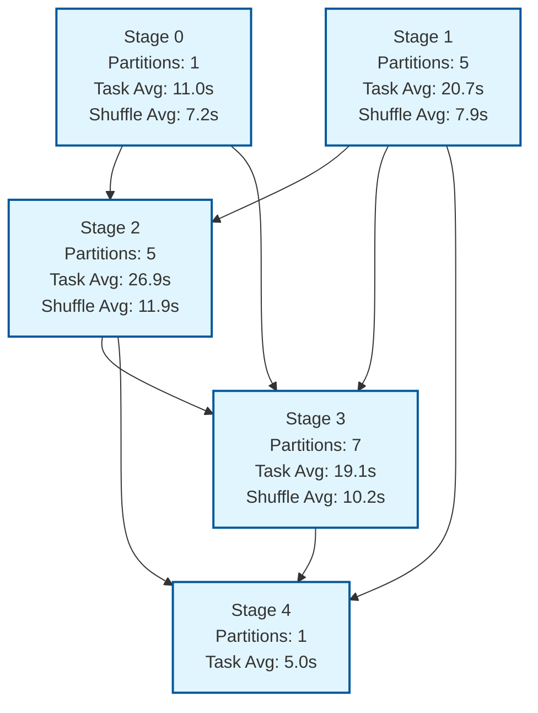

# Generated Run 3

Auto-generated DAG with complex dependencies and shuffle operations.

## DAG Structure

The following Mermaid graph shows the dependency structure between stages:

```mermaid
graph TD
    Stage0["Stage 0<br/>Partitions: 1<br/>Task Avg: 11.0s<br/>Shuffle Avg: 7.2s"] --> Stage2["Stage 2<br/>Partitions: 5<br/>Task Avg: 26.9s<br/>Shuffle Avg: 11.9s"]
    Stage1["Stage 1<br/>Partitions: 5<br/>Task Avg: 20.7s<br/>Shuffle Avg: 7.9s"] --> Stage2
    Stage0 --> Stage3["Stage 3<br/>Partitions: 7<br/>Task Avg: 19.1s<br/>Shuffle Avg: 10.2s"]
    Stage1 --> Stage3
    Stage2 --> Stage3
    Stage1 --> Stage4["Stage 4<br/>Partitions: 1<br/>Task Avg: 5.0s"]
    Stage2 --> Stage4
    Stage3 --> Stage4

    classDef stageBox fill:#e1f5fe,stroke:#01579b,stroke-width:2px
    class Stage0,Stage1,Stage2,Stage3,Stage4 stageBox
```

