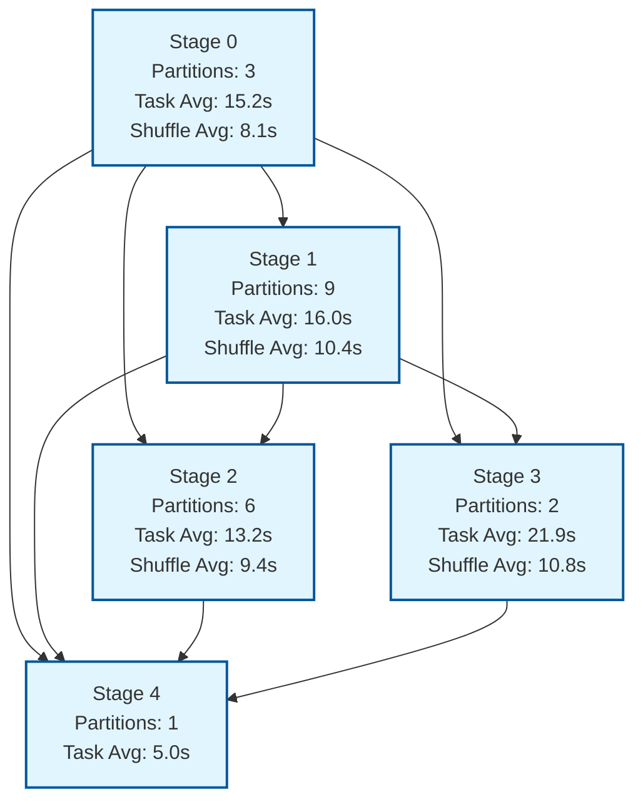

# Generated Run 4

Auto-generated DAG with complex dependencies and shuffle operations.

## DAG Structure

The following Mermaid graph shows the dependency structure between stages:

This generated DAG demonstrates:
- Single root stage (0) feeding into multiple branches
- High fan-out from Stage 0 to all other stages
- Complex convergence at final Stage 4 from all intermediate stages
- Highest partition count in Stage 1 (9 partitions)
