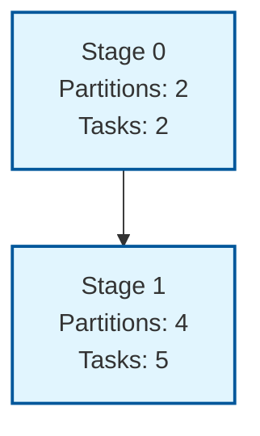

# Shuffle Example DAG

This example demonstrates a shuffle operation with stage dependencies.

## DAG Structure

The following Mermaid graph shows the dependency structure between stages:

## Stage Details

- **Stage 0**: Initial stage with 2 partitions and 2 tasks (no dependencies)
- **Stage 1**: Shuffle stage with 4 partitions and 5 tasks (depends on Stage 0)

The shuffle operation increases the number of partitions from 2 to 4, requiring data redistribution between stages.
