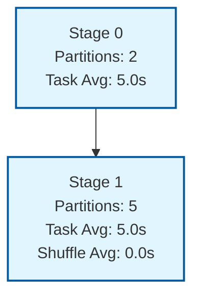

# Shuffle

Shuffle operation with stage dependencies.

## DAG Structure

The following Mermaid graph shows the dependency structure between stages:

```mermaid
graph TD
    Stage0["Stage 0<br/>Partitions: 2<br/>Task Avg: 5.0s"] --> Stage1["Stage 1<br/>Partitions: 5<br/>Task Avg: 5.0s<br/>Shuffle Avg: 0.0s"]

    classDef stageBox fill:#e1f5fe,stroke:#01579b,stroke-width:2px
    class Stage0,Stage1 stageBox
```