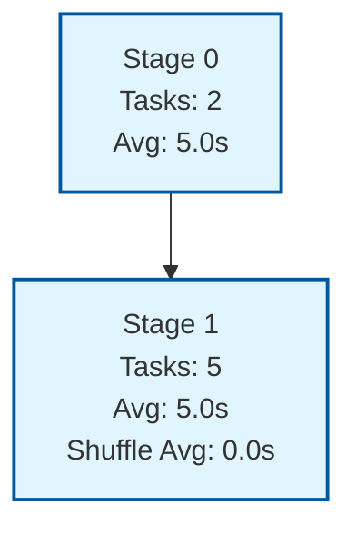

# Shuffle Example DAG

This example demonstrates a shuffle operation with stage dependencies.

## DAG Structure

The following Mermaid graph shows the dependency structure between stages:

## Stage Details

- **Stage 0**: Initial stage with 2 tasks (no dependencies)
  - Average execution time: 5.0 seconds
- **Stage 1**: Shuffle stage with 5 tasks (depends on Stage 0)
  - Average execution time: 5.0 seconds
  - Average shuffle time: 0.0 seconds

The shuffle operation increases the number of tasks from 2 to 5, requiring data redistribution between stages.
